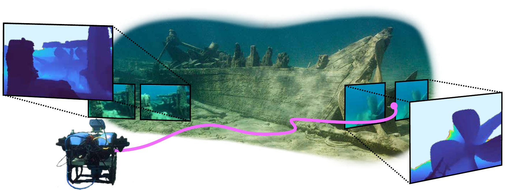

# SurfSLAM: Sim-to-Real Underwater Stereo Reconstruction For Real-Time SLAM

[](https://arxiv.org/abs/2601.10814)
[](https://umfieldrobotics.github.io/SurfSLAM/)
[](https://deepblue.lib.umich.edu/data/concern/data_sets/r781wh411)
[](https://github.com/umfieldrobotics/SurfSLAM)

<h4 align="center">
  <a href="https://www.obagoren.com/">Onur Bagoren</a><sup>*</sup>
  &nbsp;&nbsp;<b>&middot;</b>&nbsp;&nbsp;
  <a href="https://sethgi.me/">Seth Isaacson</a><sup>*</sup>
  &nbsp;&nbsp;<b>&middot;</b>&nbsp;&nbsp;
  <a href="https://sacchinbhg.github.io/">Sacchin Sundar</a>
  &nbsp;&nbsp;<b>&middot;</b>&nbsp;&nbsp;
  <a href="https://ycsun2113.github.io/">Yung-Ching Sun</a>
  <br><br>
  <a href="https://anja-sheppard.github.io/">Anja Sheppard</a>
  &nbsp;&nbsp;<b>&middot;</b>&nbsp;&nbsp;
  <a href="https://haoyuma2002814.github.io/">Haoyu Ma</a>
  &nbsp;&nbsp;<b>&middot;</b>&nbsp;&nbsp;
  <a href="https://www.linkedin.com/in/abrar-shariff">Abrar Shariff</a>
  &nbsp;&nbsp;<b>&middot;</b>&nbsp;&nbsp;
  <a href="https://www.roahmlab.com/ram-personal">Ram Vasudevan</a>
  &nbsp;&nbsp;<b>&middot;</b>&nbsp;&nbsp;
  <a href="https://fieldrobotics.engin.umich.edu/team">Katherine A. Skinner</a>
</h4>

<p align="center">
  <sub><i><sup>*</sup>Equal contribution</i></sub>
</p>

<p align="center">
  
  <br>
  <sub><i>Background image courtesy of the National Oceanic and Atmospheric Administration Thunder Bay National Marine Sanctuary.</i></sub>
</p>

<details>
<summary><b>Abstract (Click to Expand)</b></summary>
Localization and mapping are core perceptual capabilities for underwater robots. Stereo cameras provide a low-cost means of directly estimating metric depth to support these tasks. However, despite recent advances in stereo depth estimation on land, computing depth from image pairs in underwater scenes remains challenging. In underwater environments, images are degraded by light attenuation, visual artifacts, and dynamic lighting conditions. Furthermore, real-world underwater scenes frequently lack rich texture useful for stereo depth estimation and 3D reconstruction. As a result, stereo estimation networks trained on in-air data cannot transfer directly to the underwater domain. In addition, there is a lack of real-world underwater stereo datasets for supervised training of neural networks. Poor underwater depth estimation is compounded in stereo-based Simultaneous Localization and Mapping (SLAM) algorithms, making it a fundamental challenge for underwater robot perception. To address these challenges, we propose a novel framework that enables sim-to-real training of underwater stereo disparity estimation networks using simulated data and self-supervised finetuning. We leverage our learned depth predictions to develop SurfSLAM, a novel framework for real-time underwater SLAM that fuses stereo cameras with IMU, barometric, and Doppler Velocity Log (DVL) measurements. Lastly, we collect a challenging real-world dataset of shipwreck surveys using an underwater robot. Our dataset features over 24,000 stereo pairs, along with high-quality, dense photogrammetry models and reference trajectories for evaluation. Through extensive experiments, we demonstrate the advantages of the proposed training approach on real-world data for improving stereo estimation in the underwater domain and for enabling accurate trajectory estimation and 3D reconstruction of complex shipwreck sites.
</details>

## Datasets

See **[docs/data.md](docs/data.md)** for downloading the data release and pointing this
repo at it. Short version:

```bash
cp config/dataset_paths.example.yaml config/dataset_paths.yaml
## ** fill in config/dataset_paths.yaml with the paths you have **
python utils/dataset_paths.py       # check what resolves
```

## Setup

We highly recommend using docker for this project and don't provide explicit support for non-docker setups. 

Check out the model submodules and apply our patches to them:
```bash
./scripts/setup_submodules.sh
```

The submodules point at their original upstream repositories (NVlabs/FoundationStereo,
DEFOM-Stereo, IGEV-plusplus, and others), pinned to exact commits. Our changes to them
are not vendored -- they live in [`patches/`](patches/), one file per submodule, and
this script applies them. It is idempotent, so re-run it any time; `--check` reports
the state without changing anything. See **[docs/submodules.md](docs/submodules.md)**.

Then build the docker image. This pulls an image from docker hub that has most dependencies installed, then adds a user-specific configuration and mounts all the data paths.

```bash
cd docker/
./build_user.sh
./run.sh # starts a container, or attaches to an existing container (allowing multiple terminals)
./run.sh restart # restarts the container, discarding any changes you have made to the local container
```

See **[docs/docker.md](docs/docker.md)** for more details.


## Demo

Run a released model on a stereo pair, from the command line or in a browser. Six example pairs from our shipwreck surveys are included.

```bash
python -m demo --list-scenes                     # what's bundled
python -m demo --list-checkpoints                # what weights resolve on this machine
python -m demo --scene monohansett_hull          # colorized disparity + metric depth
python -m demo --left L.png --right R.png        # your own (rectified) pair

python -m demo.web                               # browser UI on http://localhost:7860
```

See **[docs/demo.md](docs/demo.md)** for every option, and for how to run on your own unrectified images.


## Training

### Setup
You should setup wandb, or explicitly disable it:

```bash
wandb login # highly recommended; otherwise use `wandb disabled` or `wandb offline`.
```

You may then optionally copy and edit [config/train/wandb.example.yaml](config/train/wandb.example.yaml) to specify a non-default entity and project.

An experiment is a model crossed with an ablation; one launcher runs any pair.

```bash
./train_scripts/launch.sh defom_stereo/warp_finetune_full --gpus 0,1
./train_scripts/launch.sh --model igev_pp --ablation full_pretrain --gpus 0
./train_scripts/launch.sh --list          # models and ablations available
./train_scripts/launch.sh --help
```

See **[docs/configurations.md](docs/configurations.md)** for an in-depth description.


## Evaluation

There are three steps to evaluation: **inference** (iterates over a dataset and predicts disparity using a pretrained model), **scoring** (evaluates predictions against ground-truth), and **reconstruction**, which computes 3D metrics.

### Inference

For inference, you specify a model and a test suite. Test suites currently include `suds_test` (for quantitative evaluations on our data) and `qualitative`, which aggregates datsets without ground-truth. The API is as follows:

```bash
./eval_scripts/inference.sh defom_stereo/suds_test 0        # the quantitative benchmark
./eval_scripts/inference.sh defom_stereo/qualitative 0      # third-party footage, no ground truth
./eval_scripts/inference.sh --list                          # models and suites available
./eval_scripts/inference.sh --help
```

Results land under `eval/<model>/<run>/`:

| File | Contents |
| --- | --- |
| `<stage>/metrics.csv` | one row per frame |
| `<stage>/summary.json` | per-scene and overall, plus the run's settings |
| `<stage>/<scene>/data/<frame>.pt` | predicted disparity, ground truth, calibration |
| `<stage>/<scene>/viz/<frame>.png` | colormapped disparity |
| `comparison.csv` | one row per checkpoint |

Reported metrics are EPE, RMSE, bad-1/2/3 and D1, pixel-weighted across frames.

Additional examples of the `inference.sh` API:
```bash
./eval_scripts/inference.sh defom_stereo/suds_test 0 evaluation.checkpoints=[ours,full_pretrain]
./eval_scripts/inference.sh defom_stereo/suds_test 0 evaluation.max_frames=8   # smoke test
```

Runs are resumable: re-running skips frames whose outputs are already on disk (`evaluation.skip_existing=false` to force a redo).

### Scoring

`score.sh` repeats the metric computation from inference without repeating inference:

```bash
./eval_scripts/score.sh tbnms scoring.run=eval/defom_stereo_suds_test
```

### Reconstruction

`reconstruction.sh` compares a mesh or per-frame depth maps against a ground-truth point cloud (Chamfer, accuracy/completeness, F-score). Needs open3d and kaolin.

```bash
./eval_scripts/reconstruction.sh mesh reconstruction.mesh=recon.obj reconstruction.gt_cloud=fused.ply
```

See **[docs/configurations.md](docs/configurations.md)** for the full config reference.


## Acknowledgements

Code in this repo is based on the following:
1. [FoundationStereo](https://github.com/NVlabs/FoundationStereo) (NVlabs) — *FoundationStereo: Zero-Shot Stereo Matching*
2. [DEFOM-Stereo](https://github.com/Insta360-Research-Team/DEFOM-Stereo) (Insta360 Research Team) — *DEFOM-Stereo: Depth Foundation Model Based Stereo Matching*
3. [IGEV++](https://github.com/gangweiX/IGEV-plusplus) — *IGEV++: Iterative Multi-range Geometry Encoding Volumes for Stereo Matching*
4. [Underwater_Stereo](https://github.com/Jinyi-Z/Underwater_Stereo) — *Underwater Depth Estimation via Stereo Adaptation Networks*

We thank the authors of these works for making their code available. Each submodule remains under its upstream license; see [`models/`](models/) and [`patches/`](patches/) for how our modifications are applied.